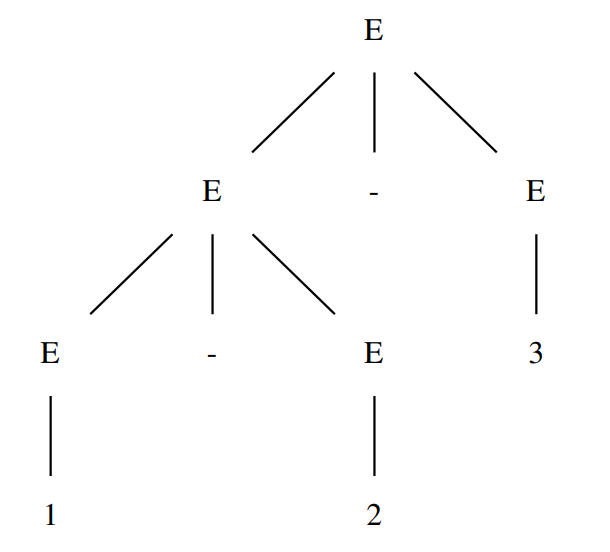
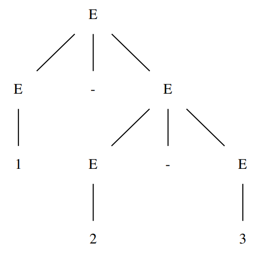

 # 语法分析

## 通过 ANTLR4 生成语法分析器

此处我们研究一个名为 Cymbol 的语言，是 C 语言的子集（代码附后）：

这样的文法有几个问题：

- 二义性：一段程序可以有多种解释方法。

    ```antlr
    stat: 'if' expr 'then' stat
    	| 'if' expr 'then' stat 'else' stat
    	| expr
    	;
    ```

    假设此时有这样的程序：`if a then if b then c else d`，会出现二义性：

    - `if a then` `if b then c else d`；
    - `if a then` `if b then c` `else d`。

    这种语法歧义被称为“悬空的 `else`”。

    如何修改这样有二义性的文法？

    我们将文法修改为：

    ```antlr
    stat: matched_stat | open stat ;
    
    matched_stat: 'if' expr 'then' matched_stat 'else' matched_stat
                | expr
                ;
    
    open_stat: 'if' expr 'then' stat
             | 'if' expr 'then' matched_stat 'else' open_stat
             ;
    ```

    改造后的文法实现了第一种解释。

    为什么？

    - 证明改造前后接受的语句集合是相同的；
    - 证明改造后的文法无二义性。

    证明留做习题（

    但是注意到，通过 ANTLR4 测试改造前的文法，发现同样实现的是第一种解释，并无二义性。原因是 ANTLR4 会按照从上向下的顺序分配优先级，越往上的优先级越高，所以这种实现也是正确的。

- 运算符的**结合性**带来的二义性：

    ```antlr
    expr: expr '*' expr
    	| expr '-' expr
    	| DIGIT
    	;
    ```

    对于此文法，`1-2-3` 会被解释为 `(1-2)-3` 或 `1-(2-3)`：

    

    

    在 ANTLR4 中，如果未明确运算符是左结合还是右结合，默认左结合，即上述表达式被解释为 `(1-2)-3`。

    如果想指定右结合，可以在语句前加入 `<assoc = right>`，如：

    ```antlr
    expr: '!' expr
    	| <assoc = right> expr '^' expr
    	| DIGIT
    	;
    ```

    考虑前缀运算符，这东西不带来歧义，只有一种解析方式，即右结合；后缀运算符只能左结合。

- 运算符的**优先级**带来的二义性：

```antlr
grammar Cymbol;

@header {
    package cymbol;
}

prog: (varDecl | functionDecl)* EOF ;

varDecl: type ID ('=' expr)? ';' ;

/*等价于
varDecl: type ID ';'
       | type ID '=' expr ';'
       ;
*/

type: 'int' | 'double' | 'void' ;

// type ID, type ID, ...
functionDecl: type ID '(' formalParameters? ')' block ;

formalParameters: formalParameter (',' formalParameter)* ;

formalParameter: type ID ;

block: '{' stat* '}' ;

stat: block // 语句嵌套
    | varDecl
    | 'if' expr 'then' stat ('else' stat)?
    | 'return' expr? ';'
    | expr '=' expr ';'
    | expr ';'
    ;

expr: ID '(' exprList? ')' // function call
    | expr '[' expr ']' // array subscript
    // 高维数组时展开前面的 expr，从后依次到前构造
    | '-' expr
    | '!' expr
    | <assoc = right> expr '^' expr
    | expr ('*' | '/') expr
    | expr ('+' | '-') expr
    | expr ('==' | '!=') expr
    | '(' expr ')'
    | ID
    | INT
    ;

exprList: expr (',' expr)* ;

// alt+insert to generate literal tokens
EQUAL : '=' ;
SEMI : ';' ;
DOUBLE : 'double' ;
VOID : 'void' ;
LPAREN : '(' ;
RPAREN : ')' ;
COMMA : ',' ;
LBRACE : '{' ;
RBRACE : '}' ;
IF : 'if' ;
THEN : 'then' ;
ELSE : 'else' ;
RETURN : 'return' ;
LBRACK : '[' ;
RBRACK : ']' ;
SUB : '-' ;
BANG : '!' ;
CARET : '^' ;
MUL : '*' ;
DIV : '/' ;
ADD : '+' ;
EQUAL_EQUAL : '==' ;
NOT_EQUAL : '!=' ;

WS  : [ \t\n\r]+ -> skip ;

ID : LETTER (LETTER | DIGIT)* ;
INT : '0' | [1-9]DIGIT* ;

fragment LETTER : [a-zA-Z] ;
fragment DIGIT : [0-9] ;
```

