## 词法分析

我们令 **id** 表示以字母开头的包含字母、数字的字符串，id 定义了一个集合，称之为**语言（Language）**。

id 中使用了字母、数字等符号集合，称之为**字母表（Alphabet）**。

语言中的每个元素（标识符）称为**串（String）**。

> **字母表** $\Sigma$ 是一个有限的符号集合。
>
> 字母表 $\Sigma$ 上的**串**（$s$）是由 $\Sigma$ 中的符号组成的一个**有穷**序列。$\epsilon$ 表示空串，其长度 $|\epsilon| = 0$。

在两个串 $x$ 和 $y$ 上可以做连接运算 $xy$，例如：$x=\text{dog}, y = \text{house} \rightarrow xy=\text{doghouse}$。特殊的，$s\epsilon = \epsilon s = s$。 

由连接运算可以定义指数运算 $s^i$：
$$
\begin{aligned}
s^0 &\triangleq \epsilon \\
s^i &\triangleq ss^{i-1}, i>0
\end{aligned}
$$
意为自连接 $i$ 次。

**语言**是给定字母表 $\Sigma$ 上一个任意的**可数的**串集合。当集合中没有串时，称为**空语言** $\varnothing$。

> 注意区分 $\varnothing$ 和 $\{\epsilon\}$。
>
> 语言举例：**id**: $\{a, b, c, a1, a2, \dots\}$；**ws**: $\{\text{blank}, \text{tab}, \text{newline}\}$；**if**: $\{\text{if}\}$。

由于**语言是串的集合**，因此我们可以通过对集合的操作**构造**新的语言。

> 例如：
>
> - $L$ 和 $M$ 的并：$L \cup M = \left\{s \mid s \in L \vee s \in M\right\}$；
> - $L$ 和 $M$ 的连接：$LM = \left\{xy \mid x \in L \wedge y \in M\right\}$；
> - $L$ 的幂：$L^i = \left\{s_1s_2\dots s_i \mid s_i \in L\right\}$，即 $L$ 中的任意元素连接 $i$ 次；
> - $L$ 的 Kleene 闭包：$L^* = \bigcup_{i=0}^\infty L^i$；
> - $L$ 的正闭包：$L^+ = \bigcup_{i=1}^\infty L^i$。

可以注意到
$$
\begin{aligned}
L^* &= L^0 \bigcup L^+ \\
L^+ &= LL^* = L^*L
\end{aligned}
$$
闭包运算允许我们通过有限的集合构造无穷集合。

> 令 $L$ 为所有大小写字母的集合，$D$ 为所有数字的集合，则 $L(L\cup D)^*$ 的含义为以字母开头的任意字母和数字组合的字符串。

对照语言举例，发现 **id** 的定义即为 $L(L\cup D)^*$。

如何让 parser 知道 **id** 是这样定义的？

### 正则表达式

每个正则表达式 $r$ 对应着一个正则语言 $L(r)$，正则表达式是**语法**，正则语言是**语义**。

正则表达式对应的正则语言：

$$
L(\epsilon) = \{\epsilon\}
$$

$$
L(a) = \{a\}, \forall a \in \Sigma
$$

$$
L((r)) = L(r)
$$

$$
L(r\mid s) = L(r) \bigcup L(s) \quad L(rs) = L(r)L(s) \quad L(r^*) = (L(r))^*
$$

正则表达式中的表达式及其匹配：

|     表达式     |                  匹配                   |     例子      |
| :------------: | :-------------------------------------: | :-----------: |
|      $c$       |        单个**非运算符**字符 $c$         |      $a$      |
| $\backslash c$ |          字符 $c$ 的**字面值**          | $\backslash*$ |
|     "$s$"      |           串 $s$ 的**字面值**           |    "$**$"     |
|       .        |       **除换行符以外**的任何字符        |    $a.*b$     |
|       ^        |               一行的开始                |     ^abc      |
|       $        |               一行的结尾                |     abc$      |
|     $[s]$      |       字符串 $s$ 中的任意一个字符       |    $[abc]$    |
|      [^s]      |     不在字符串 $s$ 中的任意一个字符     |    [^abc]     |
|      $r*$      |   和 $r$ 匹配的零个或多个串连接成的串   |     $a*$      |
|      $r+$      |   和 $r$ 匹配的一个或多个串连接成的串   |     $a+$      |
|      $r?$      |             零个或一个 $r$              |     $a?$      |
|   $r\{m,n\}$   | 最少 $m$ 个，最多 $n$ 个 $r$ 的重复出现 |  $a\{1,5\}$   |
|    $r_1r_2$    |           $r_1$ 后加上 $r_2$            |     $ab$      |
| $r_1 \mid r_2$ |             $r_1$ 或 $r_2$              |  $a \mid b$   |
|     $(r)$      |               与 $r$ 相同               |  $(a\mid b)$  |
|   $r_1/r_2$    |        后面跟有 $r_2$ 时的 $r_1$        |   $abc/123$   |
|    $r\{n\}$    |             恰好 $n$ 个 $r$             |   $a\{5\}$    |

有些固定的匹配可以简记：

- \w $\to$ [A-Za-z0-9_]；
- \W $\to$ [\^A-Za-z0-9_]；
- \d $\to$ [0-9]；
- \l $\to$ [a-z]；
- \\_s $\to$ [ \t\r\n\v\f]；
- \S $\to$ [\^ \t\r\n\v\f]；
- \u $\to$ [A-Z]。

> Q：$\left(0 \mid (1(01^*0)^*1)\right)^*$ 表达的是什么含义？
>
> A：通过 [regex101: build, test, and debug regex](https://regex101.com/) 找规律，给定若干01串，其匹配的是**十进制下 $3$ 的倍数的二进制**，即答案集合为
> $$
> \left\{(x)_2 \mid (x)_{10} \equiv 0 \pmod p\right\}
> $$

### 自动机

自动机具有两大要素：**状态集** $S$ 以及**状态转移函数** $\delta$。

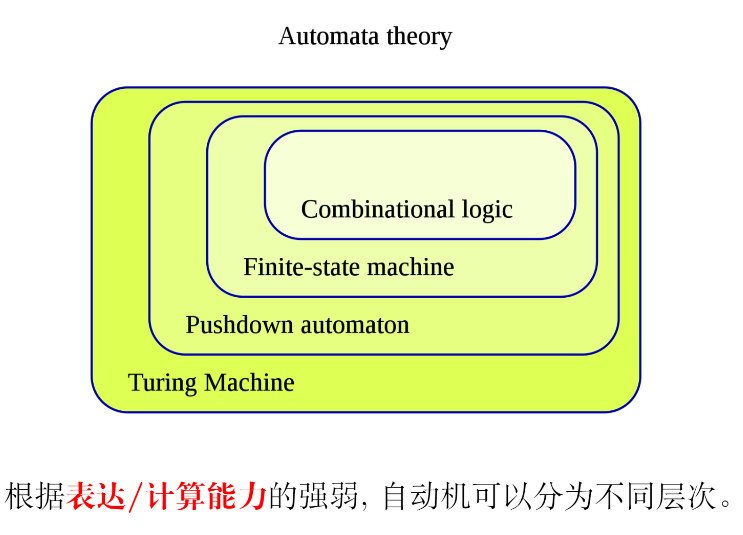

Q：如何定义一个自动机的表达能力或计算能力？

A：每个自动机 $\mathcal A$ 可以表示一个语言 $L(\mathcal A)$，通过语言集合的大小来确定表达能力。

我们希望通过若干的正则表达式 RE，最终得到一个词法分析器。

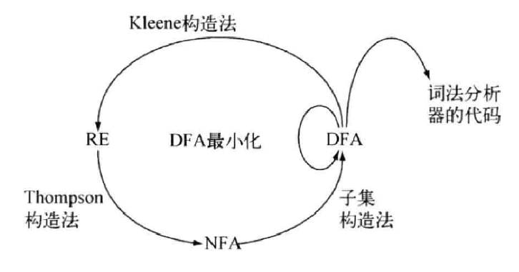

#### NFA

非确定性有穷自动机（NFA）$\mathcal A$ 是一个五元组
$$
\mathcal A = (\Sigma, S, s_0, \delta, F)
$$
包含：

- 字母表 $\Sigma$，其中 $\epsilon \notin \Sigma$；
- **有穷**的状态集合 $S$；
- **唯一**的初始状态 $s_0 \in S$；
- 状态转移**函数** $\delta$，满足

$$
\delta:S \times (\Sigma \cup \{\epsilon\}) \to 2^S
$$

​	这表示当前处于某个状态，并找到了一个字母表中的字符或空串，接下来将转移到 $S$ 的幂集。

​	$\delta(S, a)$ 表示从状态 $S$ 沿字母 $a$ 的边走向的状态，这些状态被称为**后继状态**。

> $S$ 的幂集是 $S$ 的所有子集构成的集合。

- 接受（结束/终止）状态集合 $F \subseteq S$，可以为空。

NFA 的非确定性：

- 状态转移不唯一：$\delta(S, a)$ 是一个集合；
- 若存在 $\delta(S, \epsilon)$，则某个状态 $S$ 可以通过 $\delta(S, \epsilon)$ 自发地转移至另一个状态 $S'$。

注意到 $\delta$ 是一个**函数**，意味着对于定义域中的每个元素，都应当有一个对应的映射，于是约定：**所有没有对应出边的字符都默认指向一个不存在的“空状态” $\varnothing$。**

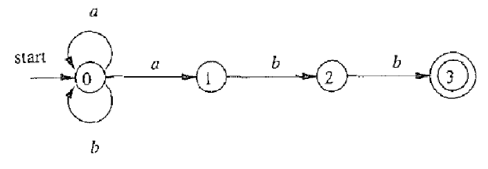

对于上方的 NFA，可以给出如下的状态转换表：

| 状态 |      $a$      |      $b$      |  $\epsilon$   |
| :--: | :-----------: | :-----------: | :-----------: |
|  0   |    {0, 1}     |      {0}      | $\varnothing$ |
|  1   | $\varnothing$ |      {2}      | $\varnothing$ |
|  2   | $\varnothing$ |      {3}      | $\varnothing$ |
|  3   | $\varnothing$ | $\varnothing$ | $\varnothing$ |

NFA 可以**识别**（接受或拒绝） $\Sigma$ 上的字符串。

（非确定性）有穷自动机 $\mathcal A$ **接受**字符串 $x$ 当且仅当**存在**一条从开始状态 $s_0$ 到**某个**接受状态 $f \in F$、标号（按顺序记录每条边上的字符）为 $x$ 的路径。

因此，$\mathcal A$ 定义了一种**语言** $L(\mathcal A)$，为 $\mathcal A$ 能接受的所有字符串构成的集合。对于上方的 NFA，不难发现 $\text{aabb} \in L(\mathcal A)$，$\text{ababab} \notin L(\mathcal A)$。

上方的 NFA 表达的语言 $L(\mathcal A) = L((a \mid b)^*abb)$，此时我们将 NFA 转化为了正则表达式。

对于一个自动机 $\mathcal A$，我们关心两个基本问题：

- Membership：给定字符串 $x$，$x \in L(\mathcal A)$？
- $L(\mathcal A)$ 究竟是什么？

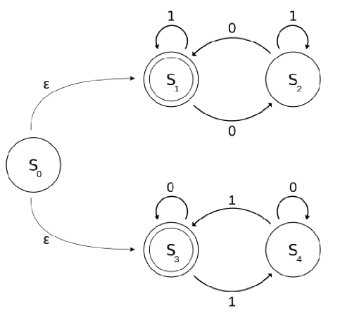

上半部分对应的正则表达式为 $\left(1^* \mid 01^*0{\color{red}1^*}\right)^*$，下半部分对应的正则表达式为 $\left(0^* \mid 10^*10^*\right)^*$，即 $L(\mathcal A)$ 是包含偶数个 0 或偶数个 1 的 01 串。

#### DFA

确定性有穷自动机（DFA）和 NFA 唯一不同在于状态转移函数 $\delta$：
$$
\delta: S \times \Sigma \to S
$$
即，不能通过空串转移状态，对于每次转移，到达的状态都是唯一的。

我们约定，所有没有对应出边的字符默认指向一个“死状态”，进入死状态后接受任何字符都会回到死状态。

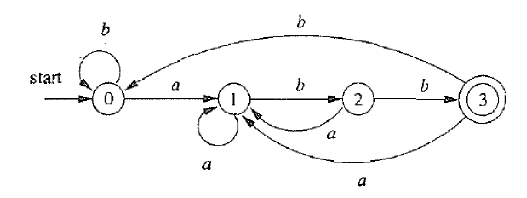

对于这个 DFA，不难得到 $\text{aabb} \in L(\mathcal A)$，$\text{ababab} \notin L(\mathcal A)$。

判断 $L(\mathcal A)$ 对应的正则表达式似乎成为了一件难事！这个 DFA 对应的 $L(\mathcal A) = L((a \mid b)^*abb)$。

是否发现问题？这个 DFA 和上面的 NFA 表达了同一个 $L(\mathcal A)$！

这表明：NFA 简便易于理解，便于描述语言 $L(\mathcal A)$；DFA 易于判断 $x \in L(\mathcal A)$，适合产生词法分析器。

所以我们用 NFA 描述语言，用 DFA 实现词法分析器。即：$\text{RE} \Longrightarrow \text{NFA} \Longrightarrow \text{DFA} \Longrightarrow \text{词法分析器}$。

### 从正则表达式到词法分析器

#### RE $\to$ NFA

我们用 $r$ 表示一个正则表达式，$N(r)$ 表示由 $r$ 构造的 NFA，我们要求 $L(r) = L(N(r))$，即二者表示的语言一致。

构造方法为 Thompson 构造法，其基本思想为**按结构归纳**：

1. $\epsilon$ 是正则表达式，构造为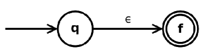；
2. $a \in \Sigma$ 是正则表达式，构造为 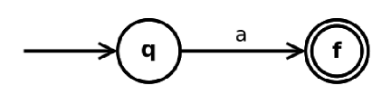；
3. 如果 $s$ 是正则表达式，则 $(s)$ 是正则表达式，无需再次构造，$N((s)) = N(s)$；
4. 如果 $s$，$t$ 是正则表达式，则 $s|t$ 是正则表达式，构造为 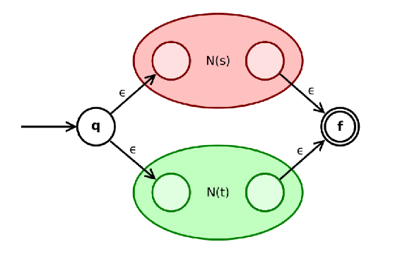；

​	Q：如果 NFA 的开始状态和接受状态不唯一怎么办？

​	A：由于 $N(s)$ 和 $N(t)$ 也是通过如此的构造方法得到的，只要每一步的开始状态和接受状态都是唯一的，则根据**归纳假设**，其开始状态和接受状态必然是唯一的。

5. 如果 $s$，$t$ 是正则表达式，则 $st$ 是正则表达式，构造为 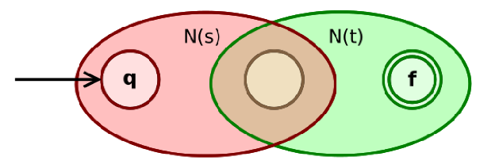；
5. 如果 $s$ 是正则表达式，则 $s^*$ 是正则表达式，构造为 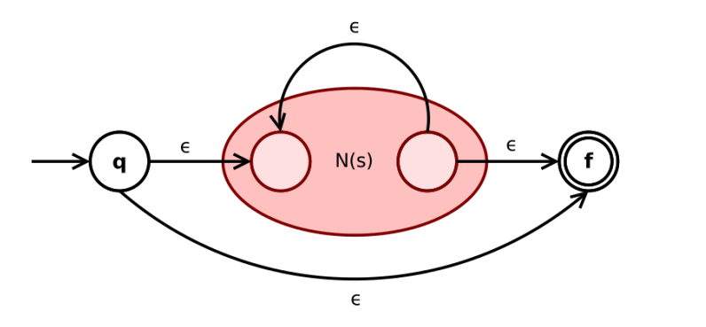。

这样构造出来的 NFA $N(r)$ 有如下的性质：

1. 开始状态和接受状态均**唯一**；
2. 开始状态没有入边，接受状态没有出边；
3. $N(r)$ 的**状态数** $|S| \leq 2 \times |r|$，其中 $|r|$ 表示 $r$ 中运算符和运算分量的总和。证明显而易见，由于每一步最多加一个开始状态和接受状态，共构造 $|r|$ 步；
4. 每个状态最多有两个 $\epsilon$-入边和两个 $\epsilon$-出边；
5. $\forall a \in \Sigma$，每个状态最多有一个 $a$-入边和一个 $a$-出边。

> 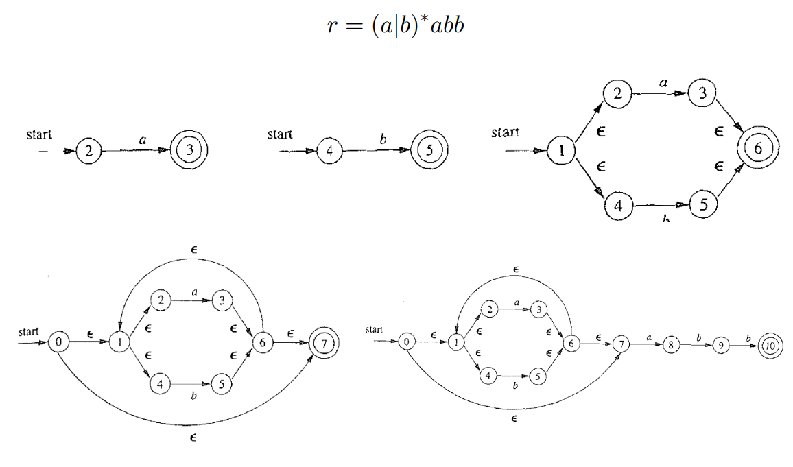
>
> 构造顺序为 $a$，$b$，$a|b$，$(a|b)^*$，$(a|b)^*abb$。

#### NFA $\to$ DFA

我们用 $N$ 表示一个 NFA，$D$ 表示一个 DFA，我们要求 $L(N)=L(D)$。

我们用**子集构造法**来完成 $N \to D$ 的任务，思路为**用 DFA 模拟 NFA**。

例：将下面的 NFA 转为 DFA。

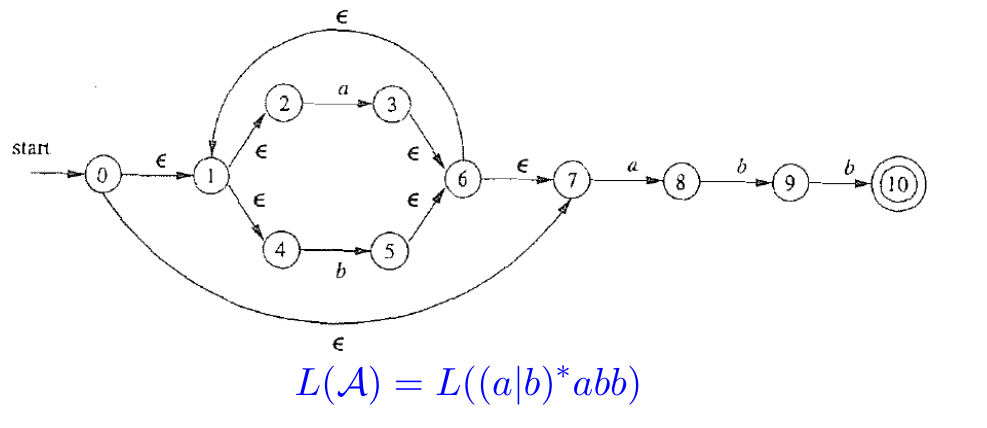

- 首先取出所有的初始状态（包括可以通过 $\epsilon$ 转移到的状态）：$\{0, 1, 2, 4, 7\}$，由于这些状态无法被区分，把它们整体当作 DFA 中的一个状态；
- 再看位于初始状态时会转移到什么状态：枚举初始状态集合中的每个状态，再枚举每条转移边：
    - 初始状态通过 $a$ 可以转移到 $\{3, 8, {\color{red}6, 7, 1, 2, 4}\}$，其中标红的是通过 $\epsilon$ 继续转移出来的状态，把它们作为 DFA 中的一个状态；
    - 通过 $b$ 可以转移到 $\{5, {\color{red}6, 7, 1, 2, 4}\}$，把它们作为 DFA 中的一个状态。
- 不断重复上面的操作，直到转化的状态集合中包含接受状态，此时就确定了 DFA 的一个接受状态。

转化的 DFA 如下：

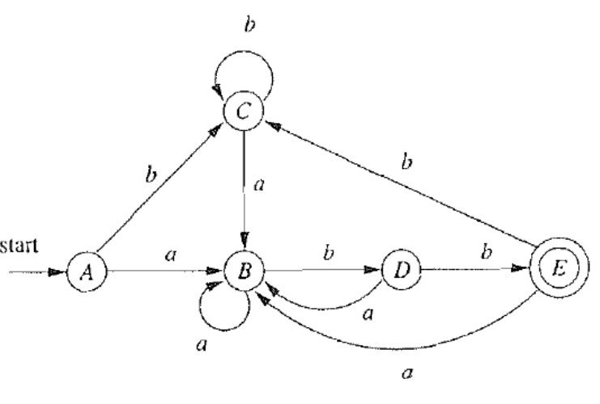

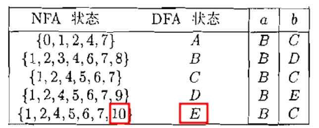

对于状态 $s$，把只通过 $\epsilon$ 转移可达的状态集合称为 $\epsilon-\text{closure}$，即：
$$
\epsilon-\text{closure}(s) = \{t \in S_N \mid s \overset{\epsilon^*}{\to} t\}
$$
对于一个状态集合 $T$，其 $\epsilon-\text{closure}$ 为
$$
\epsilon-\text{closure}(T) = \bigcup_{s \in T} \epsilon-\text{closure}(s)
$$
则 DFA 上的一次状态转移
$$
\text{move}(T, a) = \bigcup_{s \in T} \delta(s, a)
$$
子集构造法就是把一个 $N:(\Sigma_N, S_N, n_0, \delta_N, F_N)$ 转化为一个 $D:(\Sigma_D, S_D, d_0, \delta_D, F_D)$，满足：
$$
\begin{aligned}
\Sigma_D &= \Sigma_N \\
S_D &\subseteq 2^{S_N}\quad (\forall s_D \in S_D \to s_D \subseteq S_N) \\
d_0 &= \epsilon-\text{closure}(n_0) \\
\forall a \in \Sigma_D : \delta_D(s_D, a) &= \epsilon-\text{closure}\left(\text{move}(s_D, a)\right) \\
F_D &= \left\{s_D  \in S_D \mid \exists f \in F_N \wedge f \in s_D\right\}
\end{aligned}
$$
设 $|S_N| = n$，则 $|S_D| = \mathcal O(2^n)$，最坏情况下 $|S_D| = \Theta(2^n)$。

> 例：构造“长度为 $m \geq n$ 个字符的仅包含 $a$ 和 $b$ 的字符串，且倒数第 $n$ 个字符为 $a$”的 DFA。
>
> 容易写出 NFA 对应的语言：$L_n = (a|b)*a(a|b)^{n-1}$，并构造出 NFA：
>
> 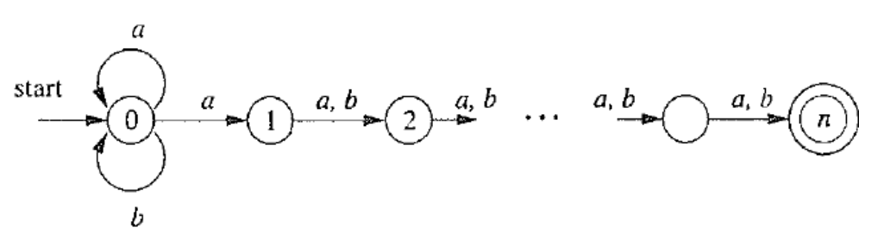
>
> 下令 $n=4$，便可得到一个确定的 NFA。如果对这个 NFA 用子集构造法构造 DFA，可得：
>
> 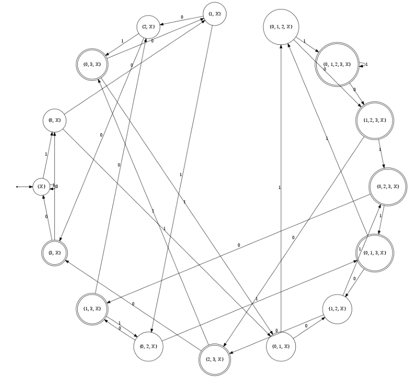
>
> 可以证明，这个 DFA 无法再被化简。

对于闭包 $f-\text{closure}$，我们对集合 $T$ 不断求闭包，实际上是在做 $T \to f(T) \to f(f(T)) \to \cdots$ 的操作，直到找到 $f$ 的不动点（$f(x)=x$），即 $T$ 不再变大。

#### DFA 最小化

DFA 最小化算法的基本思想是**等价的状态可以合并**。

如何定义**等价**？非常自然地，我们认为两个状态等价，就是它们的行为是等价的，它们经过相同的转移会到达相同的状态：
$$
s \sim t \Longleftrightarrow \forall a \in \Sigma \left((s \overset{a}{\to} s') \wedge (t \overset{a}{\to} t')\right) \Longrightarrow s' = t'
$$
事实上这种定义是不对的：

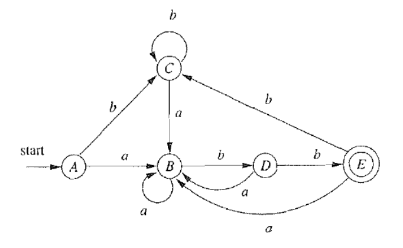

例如，$A$ 和 $E$ 都能通过 $b$ 转移到 $C$，都能通过 $a$ 转移到 $B$，但接受状态和非接受状态必然不等价！

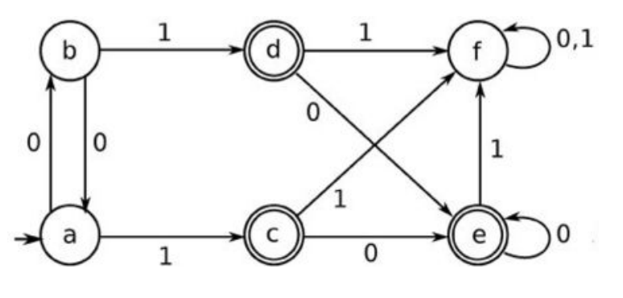

又如，按照上面的定义，可以判断 $a \not\sim b$，但实际上 $a \sim b$。

注意到上面的定义中，**相同的**状态过于严苛，只需要让它们都到达**等价的**状态：
$$
s \sim t \Longleftrightarrow \forall a \in \Sigma \left((s \overset{a}{\to} s') \wedge (t \overset{a}{\to} t')\right) \Longrightarrow s' \sim t'
$$
此时变成了一个递归定义，入口在哪？

正难则反！如果两个状态不等价，则有：
$$
s \not\sim t \Longleftrightarrow \exists a \in \Sigma\ (s \overset{a}{\to} s') \wedge (t \overset{a}{\to} t') \wedge (s' \not\sim t')
$$

